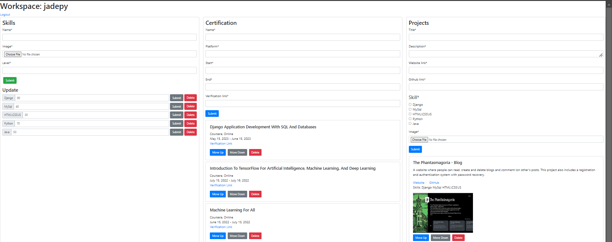
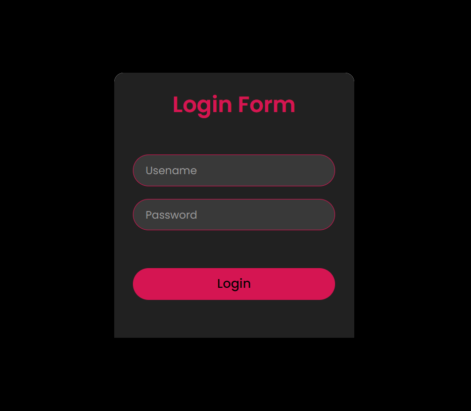
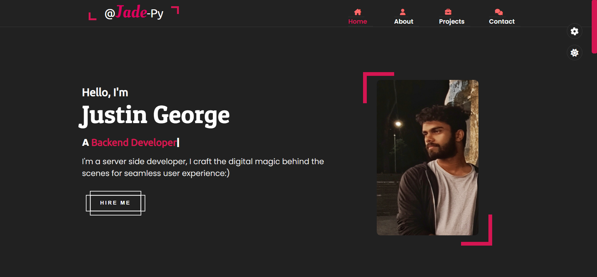

# Portfolio
A portfolio website showcasing my professional expertise, certification and hands-on experience with a personal hidden login system for a workspace to manage them instead of strenuous fiddling with code and deployment for every update.

## Key Features
- View the public portfolio at the home page
- Skills, Certification and Project showcasing
- Secure login system
- Admin workspace for content management

## Technology Stack
- **Backend Framework:** Django 
- **Frontend Framework:** HTML, CSS,Django-crispy-forms
- **Database:** MySql (Clever Cloud) 
- **Deployment Platform:** Vercel, Cloudinary (Storing and serving user uploaded static files)

## Gallery

- Workspace

- Login

- Portfolio
